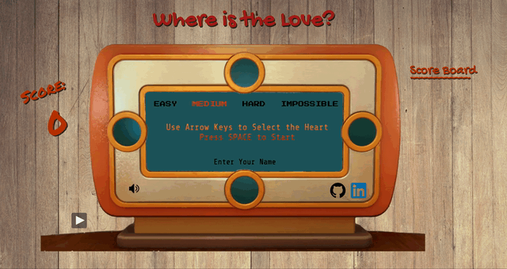

# Where is the Love? <3

A quick-reaction game based on Super Mario Party minigame "Looking for Love". Upon starting the game, the four shapes representing the suits of playing card appears randomly on the top, bottom, left, and right spots. Player uses the arrow keys to select the location of the heart before the shapes disappear. Each game has 10 rounds.

[Click Here to Play!](https://hiuhin.github.io/WhereIsTheLove/)


### Technologies
* Javascript
* Canvas
* HTML5
* CSS3

### Features



#### Levels
Player can choose from 4 levels. Each level differs in the amount of time the shapes appear on screen, ranging from 2 seconds (easy) to 400 milliseconds (impossible). A series of setTimeout are used to control clearing the shapes as well as disabling the event listeners for arrowkeys.

```
    setTimeout(() => round.clearSpots(), speed);
    setTimeout(() => toggleOff(), speed);
    setTimeout(nextRound, speed + 1500); 

```


#### Scoring
Answering correctly and quick enough earns the player 5 points. Incorrect answers results in negative 5 points. Not answering or delayed responses do not affect scores.

#### Score Board 
After each game, player's Name (optional), score, and level is recorded under the score board. A maximum of 9 records are displayed. If there are any more than 9 records, the oldest one is removed using Node.removeChild().

``` 
function addScore() {
    scoreNum += 1;

    if (scoreNum === 9) {
        scorelist_ul.removeChild(scorelist_ul.firstChild);
        scoreNum -= 1;
    }

    let div = document.createElement("div");
    div.innerText = name + " " + point + "pts" + " " + level;
    scorelist_ul.appendChild(div);
}
```

#### Sound Effects and Music

Player can toggle on and off sound effects and background music. By default, sound effects are on and background music off.

### Future Plans

* Sort score board records by points.
* Include AI players.